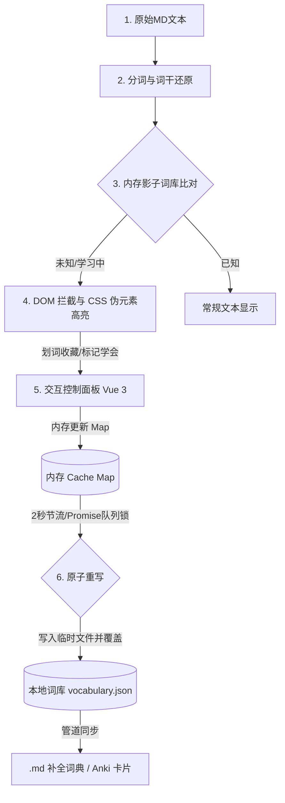

# 产品需求文档 (PRD)：Obsidian 语言学习助手 (Obsidian Language Learner)

## 1. 产品概述 (Product Overview)

### 1.1 背景与痛点
对于外语学习者而言，脱离语境孤立地背单词效率极低。LingQ 语言学习法倡导通过“透析阅读”和“基于上下文的语境”来学习外语，被证实是极其高效的输入法。然而，现有的外部阅读软件（如 Kindle、LingQ 官方 App）存在知识孤岛问题，用户标记的生词、语境无法无缝融入到本地个人知识管理系统（PKM）中。

### 1.2 产品定位
本产品是一款基于 Obsidian 平台开发的开源外语阅读与语言学习插件。它将“阅读文本 -> 自动还原分词 -> 状态比对 -> 语境高亮 -> 内存 I/O 安全落盘 -> 生物记忆复习”的完整链路闭环，无缝整合在用户的本地 Markdown 笔记本中。

### 1.3 用户群体
- 以中文为母语、利用 Obsidian 进行外刊、技术文档阅读的英语学习者。
- 重度 Obsidian 用户，期望将语言学习深度融合进个人双链知识库（PKM）的知识工作者。

---

## 2. 核心系统架构与数据流图



---

## 3. 核心功能需求 (Functional Requirements)

### F1. 文本分词与词形还原模块 (Tokenization & Lemmatization)
**需求描述**：系统需将输入的 Markdown 纯文本拆解为独立的单词单元，并进行噪音消除，同时将所有派生词还原为词干。
**业务规则**：
- **分词规则**：自动剥离 Markdown 语法标签（如双链 `[[...]]`、图片、代码块等），保留纯单词 Token，记录每个 Token 在原文中的起始与结束位置（Offset）。
- **过滤器（Noise Filter）**：自动过滤数字、特殊符号、网络链接（URL）、人名/地名等特定词。
- **词形还原（Lemmatization）**：
  - **规则匹配**：利用正则表达式处理常规变体。例如：名词复数（-s/-es/-ies）、动词时态（-ed/-ing）、形容词比较级（-er/-est）等。
  - **不规则变体映射**：内置一张轻量级不规则词表（Exception Lexicon）进行 Key-Value 极速匹配。例如将 `went` 还原为 `go`，`worst` 还原为 `bad`。
  - 所有匹配最终指向同一个 `[[单词原型 (Lemma)]]`。

### F2. 状态判定与用户本地词库模块 (State & Vocabulary DB)
**需求描述**：系统需要持久化记录用户与每个单词的熟悉关系，并以此驱动前台的高亮。
**业务规则**：
- 单词状态分为三类（WordStatus）：
  - `UNKNOWN`（陌生/生词）
  - `LEARNING`（学习中/已收藏）
  - `KNOWN`（已掌握/熟词）
- **存储结构**：数据保存在本地库的 `vocabulary.json` 中，数据结构如下：
```json
{
  "compile": {
    "status": "LEARNING",
    "lemma": "compile",
    "phonetic": "kəmˈpaɪl",
    "translation": "vt. 编辑，编制，编译",
    "context": "The compiler will compile the source code.",
    "updatedTime": "2026-05-22T19:00:00.000Z"
  }
}
```

### F3. 语境拦截高亮与零功耗悬浮窗 (Post-Processor & CSS Tooltips)
**需求描述**：在阅读模式下，系统需对生词和学习中的词进行视觉高亮，并支持鼠标悬浮时显示释义。
**业务规则**：
- **拦截渲染（Post Processor）**：注册 `registerMarkdownPostProcessor` 监听器，在 HTML 渲染前拦截 DOM。
- **Span 标签包装**：在分词扫描定位之后，将符合状态的生词包裹在特殊的 `<span>` 标签内，赋予全局命名空间前缀的 CSS 类（如 `lang-learner-word lang-learner-unknown`），并写入自定义数据集属性（如 `data-lemma="compile" data-trans="vt. 编辑，编译"`）。
- **零 JS 功耗悬浮气泡**：利用 CSS 伪元素选择器 `:hover::after` 配合 `content: attr(data-trans)` 实现悬浮释义气泡。完全不占用 JS 运行时功耗，仅在鼠标悬停时触发原生渲染。
- **增量刷新与局部重绘**：单词状态变更后，触发 Class TokenList 的微秒级局部刷新，直接改变 DOM 的类名（如移除 `lang-learner-unknown` 并添加 `lang-learner-known`），避免引发整页的排版重算。

### F4. 语境收藏本自动生成模块 (Context Note Generator)
**需求描述**：当用户在阅读中标记一个生词或将单词加入“学习中”时，自动提取当前例句并生成独立的笔记卡片。
**业务规则**：
- **例句语境抓取**：自动提取单词在当前 Markdown 文章中所处的完整句子作为 Context。
- **独立 MD 卡片生成**：在 Vault 下的 `LangLearner/Cards/` 目录下生成一个独立的 `.md` 卡片文件，文件名为该单词的原型 Lemma。
- **模板与双链绑定**：使用预设的 Front Matter 模板记录单词元数据（如词性、音标、翻译、抓取的例句语境、修改时间），且在正文部分建立指向原型 Lemma 的双链关系，实现学习体系的知识图谱化。

### F5. Vue 3 控制面板与二分冷启动估算模块 (Vue 3 Panel & Vocabulary Estimation)
**需求描述**：提供侧边栏交互视窗，以及新用户无痛初始化的词汇量测定。
**业务规则**：
- **Vue 3 侧边栏挂载**：在 Obsidian 侧边栏独立 Tab 下挂载 Vue 3 单文件组件（`Panel.vue`），展示当前焦点单词详情、快捷操作键、以及生词本列表。
- **二分查找词汇量估算**：
  - 基于二分查找算法（$\log_2 N$ 复杂度，一共仅需回答约 20 个来自不同词频梯度的代表性单词认识状态）。
  - 测试完毕后预测用户的英语词汇水位线。
  - 水位线以下的全部内置高频词，批量在内存中初始化标记为 `KNOWN`（熟词），避免用户手动标记简单词带来的体验窒息。

### F7. 文章可读性动态分级与渐进式降噪 (Text Density Tracking & Readability Grading)
**需求描述**：分析当前文章的词汇难度，并提供零重绘的渐进式难度滤镜，屏蔽低频词干扰。
**业务规则**：
- **阅读仪表盘 (Dashboard)**：在文章顶部动态显示熟词率（$\text{Known Words}/\text{Total Words}$）和难度预测（低/中/高难度），以及估算的阅读时长。
- **零重绘渐进式降噪滤镜 (Zero-Repaint Slider)**：
  - 仪表盘提供降噪滑块。**严禁通过 JS 循环遍历 Span 节点动态修改 Style/Class。**
  - **实现方案**：在分词包裹时，为每个 `<span>` 写入表示词频级别的类名（如 `rank-level-3` 代表 8000~15000 频段）。拖动滑块时，JS 仅需在文章的父容器 (Article Container) 上切换一个控制级别的类名（如 `.noise-level-3`），或修改全局的 CSS 变量（如 `--noise-opacity`）。
  - 通过 CSS 权重匹配机制一次性渲染灰色或半透明效果，将渲染重绘时间控制在 $O(1)$ 浏览器硬件加速级别：
    ```css
    .noise-level-3 .lang-learner-word.rank-level-3 {
        opacity: 0.15;
        color: var(--text-muted);
    }
    ```

### F8. 一键学完/泛化熟词 (Known-Word Generalization)
**需求描述**：读完一篇文章并标记完生词后，提供一键将该文章剩余未标记词批量标为熟词（KNOWN）的归档操作。
**业务规则**：
- **差集白名单过滤器（Anti-Pollution Filter）**：
  - 为防止长尾垃圾词、代码符号、人名、专有名词和缩写（如 `up_dong`, `iOS`, `const`）污染词库并拖慢检索性能，**一键学完操作仅对内置核心 20,000 高频词频表内的通用词汇生效。**
  - 计算公式：
    $$\text{批量泛化熟词集} = (\text{文章全量词集} \cap \text{20,000高频词表}) - \text{用户标记生词集}$$
  - 非词表内的超纲词、拼写异常词默认状态保持不变（或自动归入忽略列表），严禁写入 `vocabulary.json`。
- **内存批量泛化与节流落盘**：内存 Map 批量更新为 `KNOWN` 并自动触发 2000ms 异步节流合并落盘。

### F9. 拼写容错与模糊原型匹配 (Fuzzy Lemmatization)
**需求描述**：提供英美音拼写矫正，限制自动模糊匹配场景以防止逻辑混乱。
**业务规则**：
- **英美音重定向**：内置英美音自动对齐字典映射（如 `colour` -> `color`, `analyse` -> `analyze`）。Lemmatizer 获取原型后，如果属于拼写变体，在查本地影子词库前先重定向至美音原型。若美音原型被标记为 `KNOWN`，则该拼写变体不再做生词高亮。
- **模糊容错安全红线（Anti-Fuzzy Collision）**：
  - **严禁在 Markdown 阅读模式的自动高亮阶段进行任何静默拼写模糊容错**（例如将印错的 `form` 静默容错匹配并翻译为 `from`），以防灾难性的指鹿为马。
  - **限制场景**：Levenshtein 距离编辑算法仅在：
    1. 用户在侧边栏手动输入单词查词且无精确匹配时，作为 Suggestion (联想推荐) 引导用户纠正输入。
    2. 针对词长大于 5 个字符，且匹配不到任何原型的极低频冷僻词，在手动查询的浮窗中尝试进行微弱推荐，但不修改原文高亮。

### F10. 词组与短语优先匹配模块 (Phrasal Verb Prioritization)
**需求描述**：为防止动词短语被拆散高亮（如将 `look forward to` 拆成 `look`、`forward`、`to` 三个常规词分别翻译），建立词组优先识别机制。
**业务规则**：
- **最大前向匹配算法**：在句子分词后，分词器基于词干序列（Lemma Sequence）进行向前多词截取，最大匹配窗口 $N=4$。
- **词组字典匹配**：匹配成功的词组在影子词库或内置短语表中查询，状态若为生词/学习中，将其作为一个完整 Token 输出。
- **DOM 包裹权重压制**：词组高亮拥有最高权重。被词组高亮包裹的多个连续单词，**严禁在其内部嵌套任何单字的高亮 Span**。

### F11. 词典本地化与在线翻译降级容错机制 (Dictionary Sources)
**需求描述**：明确定义翻译与音标数据的来源，并提供离线与在线查词的降级容错。
**业务规则**：
- **内置离线基础词典**：插件安装包中预置轻量级词典数据文件（包含前 20,000 高频词的音标与极简中文释义），大小控制在 1MB 以内，在断网状态下提供基础翻译。
- **自定义词典配置**：在设置面板中，允许用户自定义配置本地离线词典文件路径（支持 `.json` 等结构化词典格式）。
- **查词降级逻辑**：
  - 查词时优先从本地内置字典和 `vocabulary.json` 影子词库中读取释义。
  - 若未命中且处于连网状态，自动异步触发在线 API 查词并缓存至内存及 `vocabulary.json` 中。
  - 若未命中且处于断网状态，悬浮气泡/面板降级显示为“离线未查到释义，连网后自动更新”，绝不引起白屏或报错。

---

## 4. 非功能性需求与底层设计 (Non-Functional Requirements)

### N1. 内存优先高并发控制 (Memory-First & Drop Lock)
- **内存影子副本（Shadow Copy）**：插件启动时，一次性把 `vocabulary.json` 读取并序列化进内存的 `Map<string, Word>` 中。前台所有的增删改查动作只针对内存 Map 进行，做到纳米级响应。
- **写回节流控制（Throttled Write）**：启用节流阀，设定延迟阈值为 $2000\text{ms}$。在 2 秒内发生的任意次数 of 内存修改，系统只在最后一刻触发 1 次批量打包重写。
- **并发队列锁（Promise Queue Lock）**：引入状态锁 `isSaving`。若前一次写盘 Promise 尚未 resolve，后续的写入动作自动排入 Promise 异步队列等待。
- **原子化覆盖（Atomic Write）**：写入时先生成 `vocabulary.json.tmp` 临时文件，校验无损后通过底层操作系统 `rename` 实现瞬间覆盖，确保在系统断电或崩溃时零数据损坏率。

### N2. 全局神经系统与解耦 (Event Bus)
- 建立基于发布-订阅（Publish-Subscribe）模式的 Event Bus。
- 单词状态改变后，核心广播自定义事件 `lang-learner:word-changed`，附带最新词汇数据包。
- 各前台活动视窗独立挂载事件监听，收到广播后进行增量局部渲染。

### N3. 移动端跨平台适配限制
- 禁止直接调用 Node.js 的文件系统接口。
- 全面通过 Capacitor 原生桥映射，统一使用 Obsidian 官方底座提供的 `this.app.vault.adapter` 抽象层进行文件流和二进制流读写。
