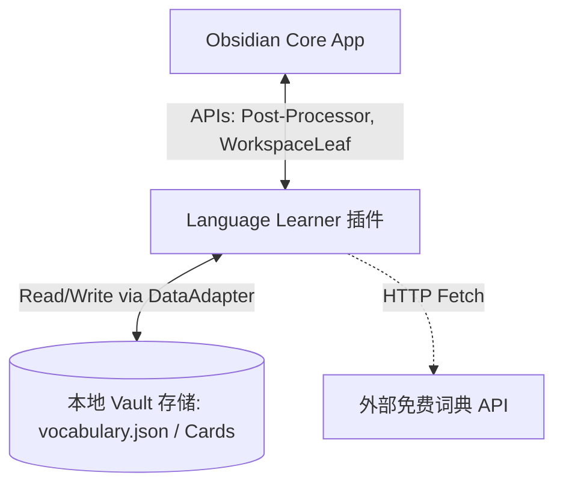

# 06_业务拓扑 (Topology)

> [!TIP]
> **用途**: 描述项目的业务边界、上下游依赖关系。

## 1. 系统依赖拓扑

## 2. 模块职责清单
- **渲染拦截器 (Post-Processor)**: 监听 Obsidian 文档渲染事件，负责识别文档文本、分词比对、包裹高亮 ``。
- **分词与还原 (Tokenizer & Lemmatizer)**: 插件的基础算法层。负责对文本进行净化和英文单词还原，消除复数、时态等干扰，并提供高频词有效性校验。
- **本地影子词库 (Shadow DB)**: 数据持久化与缓存控制层。加载 `vocabulary.json` 并维护内存 Map，通过 Promise 队列锁和 2000ms 节流实现高性能安全的落盘。
- **事件总线 (Event Bus)**: 实现发布订阅解耦。多标签文档和侧边栏 UI 面板的状态更改依靠 `lang-learner:word-changed` 广播互通。
- **Vue 3 侧边栏 (Sidebar UI)**: 人机交互的主要控制区。提供单词属性微调、估算二分查找问答、生词列表等功能。
- **卡片生成器 (Context Generator)**: 负责抓取原文句子、生成带有指向原型 Lemma 双链的卡片，自动存入 Vault 中。

## 3. 干系人
- **指挥官**: 人类开发者，负责审查与测试。
- **执行官**: Antigravity AI，负责全套逻辑编码。
