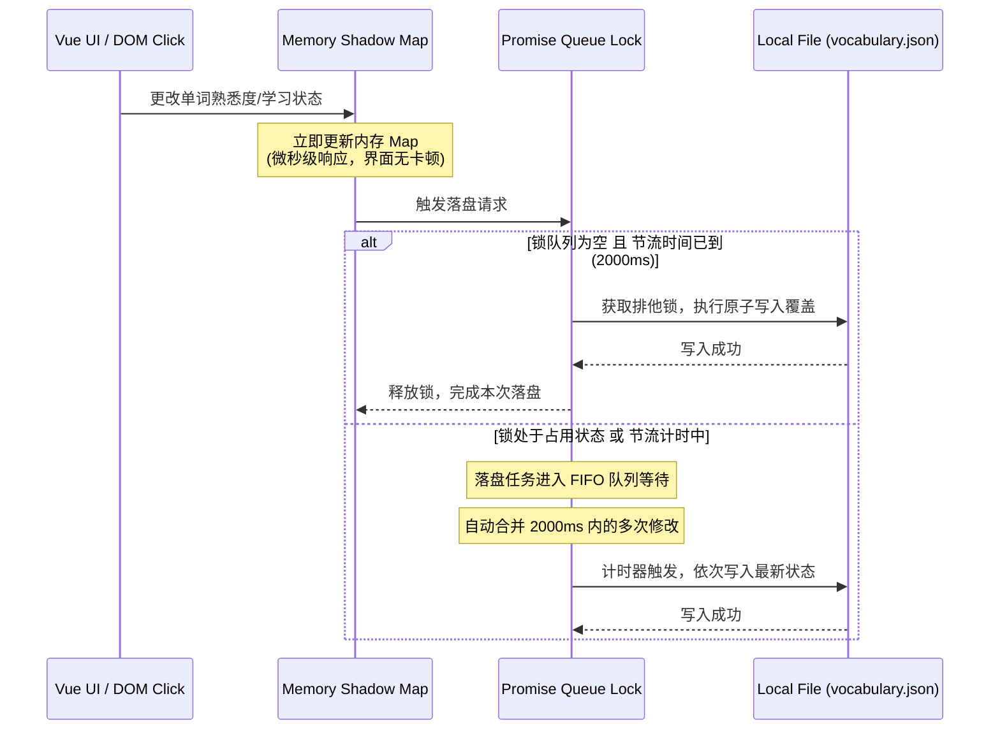

# Obsidian English Immersion Reader 项目功能与架构白皮书

> **文档定位**: 系统功能与技术架构的唯一权威白皮书 (SSOT)。
> **当前版本**: V3.0 (基于原 Obsidian Language Learner 升级重构)
> **更新时间**: 2026-05-24

---

## 1. 系统架构图

本项目采用**三层解耦、内存优先**的本地化架构，以保证在 Obsidian 沙盒（特别是移动端）中具有极高的响应速度与数据安全性。

### 1.1 核心系统拓扑图

```mermaid
graph TD
    subgraph Obsidian Host [Obsidian 宿主环境]
        DOM[Obsidian Markdown DOM]
        Leaf[Workspace Sidebar Leaf]
        Editor[Obsidian Markdown 编辑器]
        Protocol[obsidian://lang-learner-media 协议]
        GraphView[Obsidian Graph View 关系图谱]
    end

    subgraph Plugin Core [English Immersion Reader 插件核心]
        PostProcessor[Markdown 渲染拦截器]
        WordSuggest[输入建议器 EditorSuggest]
        MediaHandler[媒体协议处理器]
        GlobalDblClick[编辑器双击选词监听器]
        FileOpenListener[file-open 笔记打开监听器]
        
        subgraph Vue Panel [Vue 3 侧边栏面板 (扁平化 UI)]
            PanelVue[Panel.vue 视图]
            SM2[SM-2 间隔复习模块]
            RSSReader[RSS 阅读器模块]
            YTPresenter[YouTube / 媒体精读看板与字幕锁]
            AITeacher[AI 教师与 Native Markdown 渲染]
        end

        subgraph Engine System [算法与核心引擎]
            Tokenizer[分词引擎 $N=4$ 滑动窗口]
            Lemmatizer[词干还原引擎 中缀匹配]
            TTS[双引擎混合发音与意群断句]
        end

        subgraph Data Layer [内存影子数据层]
            ShadowDB[(内存影子 Map 缓存)]
            QueueLock[Promise 并发写入锁]
            Throttle[2000ms 写入合并节流]
        end
    end

    subgraph Disk Storage [本地磁盘存储]
        VocabFile[(vocabulary.json 词库文件)]
        CardFiles[(LangLearner/Cards/*.md 生词卡片)]
        RootFiles[(LangLearner/Roots/*.md 词根枢纽)]
        MediaNotes[(Media Notes 媒体笔记)]
    end

    %% 数据与事件交互
    DOM -->|Intercept| PostProcessor
    PostProcessor -->|Query Status| ShadowDB
    PostProcessor -->|Tokenize & Lemma| Tokenizer
    Editor -->|Trigger Suggest| WordSuggest
    WordSuggest -->|Prefix Query| ShadowDB
    GlobalDblClick -->|Selected Word Event| PanelVue
    FileOpenListener -->|Sync Word Event| PanelVue
    
    PanelVue -->|Event Bus| EventBus[Event Bus 事件总线]
    EventBus -.->|Broadcast Status Change| PostProcessor
    
    ShadowDB -->|Read/Write via Vault Adapter| VocabFile
    QueueLock --> Throttle
    Throttle -->|Atomic Override| VocabFile
    
    CardFiles -->|Context Generator| PanelVue
    CardFiles -.->|Links To| RootFiles
    RootFiles -.->|Renders Star Graph| GraphView
    Protocol -->|Seek / Open| MediaHandler
    AITeacher -->|Native Render| PanelVue
```

### 1.2 数据写入防冲突与并发队列锁时序图

为防止在多平台（如移动端闪存较慢）高频点击单词引发的数据损坏和锁死风险，写入机制采用 **2000ms 节流 + Promise 并发锁** 机制：



---

## 2. 功能脑图 (Mindmap)

### 2.1 技术实现视角脑图 (Engine Scope)

```mermaid
graph TD
    Root[Obsidian English Immersion Reader] --> F_Algo[1. 算法与分词引擎]
    Root --> F_Db[2. 影子词库与存储]
    Root --> F_Render[3. 高性能渲染高亮]
    Root --> F_UI[4. 扁平化 Vue 侧边栏]
    Root --> F_Card[5. 语境卡片与词根拓扑]
    Root --> F_TTS[6. 混合发音与句法分析]
    Root --> F_Media[7. 视频笔记与 Focus 纠偏]
    Root --> F_Suggest[8. 输入联想建议器]
    Root --> F_RSS[9. RSS 订阅阅读器]
    Root --> F_Youtube[10. YouTube 字幕与大字看板]
    Root --> F_AI[11. AI 教师与原生渲染]

    %% 1. 算法与分词引擎
    F_Algo --> F_Algo_1[Markdown 标签剥离]
    F_Algo --> F_Algo_2[滑动窗口 N=4 词组优先匹配]
    F_Algo --> F_Algo_3[不规则变形/中缀还原 Lemmatizer]
    F_Algo --> F_Algo_4[全局自主查词与桌面 Notice 双击翻译]

    %% 2. 影子词库与存储
    F_Db --> F_Db_1[2000ms 节流写入合并]
    F_Db --> F_Db_2[Promise 并发写队列锁]
    F_Db --> F_Db_3[Vault Adapter 原子重命名直写]
    F_Db --> F_Db_4[20k 内置离线字典与在线翻译降级]

    %% 3. 高性能渲染高亮
    F_Render --> F_Render_1[零 JS 功耗 hover 气泡 data-trans]
    F_Render --> F_Render_2[防词组/单字高亮 Span 嵌套包裹]
    F_Render --> F_Render_3[F7 GPU 加速降噪淡化滑块]
    F_Render --> F_Render_4[TokenList 级局部微秒类名重绘]

    %% 4. 扁平化 Vue 侧边栏
    F_UI --> F_UI_1[置顶常驻详情与发音控制栏]
    F_UI --> F_UI_2[➕/📌 一键生词快速收藏与移出]
    F_UI --> F_UI_3[二分查找快速词汇量冷启动估算]
    F_UI --> F_UI_4[F8 白名单一键学完防污染]
    F_UI --> F_UI_5[配置面板并排分栏与独立滚动]

    %% 5. 语境卡片与词根拓扑
    F_Card --> F_Card_1[抓取整句生成独立 Lemma.md]
    F_Card --> F_Card_2[Front Matter 解析与追加去重]
    F_Card --> F_Card_3[Roots/ 词根枢纽网络构建]
    F_Card --> F_Card_4[Graph View 星状拓扑星图激活]
    
    %% 6. 混合发音与句法分析
    F_TTS --> F_TTS_1[意群断句大介词换气]
    F_TTS --> F_TTS_2[自适应语速调优 Tempo Tuning]
    F_TTS --> F_TTS_3[在线特权代理 requestUrl 绕过 CORS]
    F_TTS --> F_TTS_4[系统 TTS 路由兜底与词源持久化]

    %% 7. 视频笔记与 Focus 纠偏
    F_Media --> F_Media_1[SM-2 算法间隔复习界面]
    F_Media --> F_Media_2[时间戳一键插入与点击 seeks 跳转]
    F_Media --> F_Media_3[YouTube Iframe / Bilibili 进度同步]
    F_Media --> F_Media_4[多路备用定位与 Focus Shift 自动偏置修正]

    %% 8. 输入联想建议器
    F_Suggest --> F_Suggest_1[EditorSuggest 拦截输入前缀]
    F_Suggest --> F_Suggest_2[生词本优先/高频白名单兜底]
    F_Suggest --> F_Suggest_3[基础模糊拼写容错判定]

    %% 9. RSS 订阅阅读器
    F_RSS --> F_RSS_1[RSS 订阅源增删改查]
    F_RSS --> F_RSS_2[跨域拉取与 XML DOMParser 解析]
    F_RSS --> F_RSS_3[阅读正文直接运行分词高亮与交互]

    %% 10. YouTube 字幕与大字看板
    F_Youtube --> F_Youtube_1[在线/本地 SRT 字幕解析]
    F_Youtube --> F_Youtube_2[Gaps 间隙锁频防抖同步滚动]
    F_Youtube --> F_Youtube_3[当前播放句大字精读互动看板]
    F_Youtube --> F_Youtube_4[时间戳超链接批量 MD 导出]

    %% 11. AI 教师与原生渲染
    F_AI --> F_AI_1[AI 单词语境与记忆分析]
    F_AI --> F_AI_2[MarkdownRenderer 原生排版解析渲染]
    F_AI --> F_AI_3[全局编辑器双击选词清洗与广播]
    F_AI --> F_AI_4[file-open 笔记打开侦听瞬间绑定同步]
```



---

### 2.2 用户感官与场景视角脑图 (User Experience Scope)

```mermaid
graph TD
    RootUX[学习者感官体验闭环] --> UX_Init[A. 轻松冷启动]
    RootUX --> UX_Read[B. 沉浸式精读]
    RootUX --> UX_Media[C. 交互式视听笔记]
    RootUX --> UX_Sound[D. 影子陪伴真人朗读]
    RootUX --> UX_Memory[E. 科学复习与写作]

    %% A. 轻松冷启动
    UX_Init --> UX_Init1["2分钟自适应测词量<br/>(20道题趣味二分查找)"]
    UX_Init --> UX_Init2["一键自动屏蔽背景词汇<br/>(过滤已知熟词，避免满屏花哨)"]

    %% B. 沉浸式精读
    UX_Read --> UX_Read1["划过单词秒现释义<br/>(零延迟悬浮泡泡)"]
    UX_Read --> UX_Read2["智能多词短语高亮<br/>(鼠标划过短语一体高亮)"]
    UX_Read --> UX_Read3["视觉背景降噪滑块<br/>(拉动滑块渐进隐去熟词，凸显生词)"]
    UX_Read --> UX_Read4["双击单词系统弹窗通知<br/>(免开侧边栏的桌面快速翻译)"]
    UX_Read --> UX_Read5["RSS新闻/博客一站精读<br/>(直接在笔记里读外刊)"]
    UX_Read --> UX_Read6["免跳转专注查词<br/>(查词仅更新侧栏顶部，底部阅读不打断)"]

    %% C. 交互式视听笔记
    UX_Media --> UX_Media1["看视频一键插入时间戳笔记<br/>(自动关联当前媒体秒数)"]
    UX_Media --> UX_Media2["点击笔记时间戳精准跳转<br/>(点击超链接视频指哪播哪)"]
    UX_Media --> UX_Media3["歌词式大字字幕实时精读看板<br/>(点击大字可重播发音与查词)"]
    UX_Media --> UX_Media4["字幕滚动丝滑不闪烁<br/>(间隙锁定算法消除空白期抖动)"]
    UX_Media --> UX_Media5["一键导出精读底稿<br/>(整篇字幕带跳转超链接直接插入文档)"]

    %% D. 影子陪伴真人朗读
    UX_Sound --> UX_Sound1["纯正英美音真人发音<br/>(在线发音特权代理)"]
    UX_Sound --> UX_Sound2["离线发音自动降级切换<br/>(网络不好也绝对不报错，秒换系统离线声)"]
    UX_Sound --> UX_Sound3["像真人一样的‘意群换气’<br/>(朗读句子在停顿处自然呼吸)"]
    UX_Sound --> UX_Sound4["难词自动慢读<br/>(语速根据生词难度智能调优)"]
    UX_Sound --> UX_Sound5["单词故事与记忆联想故事展示<br/>(内置词源小百科)"]

    %% E. 科学复习与写作
    UX_Memory --> UX_Memory1["自动语境生词卡生成<br/>(自动提取整句，生成独立 Lemma 卡)"]
    UX_Memory --> UX_Memory2["相同单词自动追加入新句子<br/>(去重且绝对不弄乱自己写的笔记)"]
    UX_Memory --> UX_Memory3["科学 SM-2 算法间隔卡片复习<br/>(智能调度，只背快要遗忘的词)"]
    UX_Memory --> UX_Memory4["写英文日记时自动补全我的生词<br/>(打字时优先联想推荐自己记过的单词)"]
    UX_Memory --> UX_Memory5["词根双链网络<br/>(通过Roots笔记织网，点亮 Graph View)"]
```



---

## 3. 功能点详细清单

### 功能 1：算法与分词引擎 (Tokenizer & Lemmatizer)
*   **Markdown 标签剥离**：利用原生 TreeWalker 和 DOM 选项过滤 Markdown 和 HTML 语法噪声，精确定位和提取文本中的纯文本词汇，并完整记录每个 Token 的字符起始偏移位置。
*   **滑动窗口词组优先匹配 ($N=4$)**：分词时采用最大向前滑动窗口匹配（深度为 4 词），优先识别多词搭配短语（如 `look forward to`），并将其作为一个独立的 Token 输出，防止拆散短语破坏语义。
*   **不规则变形与中缀还原 (Lemmatizer)**：内置 2 万词频变形对照库，支持动词时态、名词复数、形容词比较级还原，并支持中缀词性还原算法（如输入稀有词 `languished` 智能溯源到原型 `languish`，摆脱高频白名单依赖）。
*   **安全拼写容错红线**：严禁自动修改源文件高亮替换，仅在用户点击或手动输入查词时，提供基于词干的侧边栏查词建议和超纲词非侵入式联想，保证原文不被污染。
*   **全局自主查词系统**：在侧边栏顶部内置手动查词检索框，用户输入单词后，直接通过 Lemmatizer 引擎还原词干并更新顶部查词详情，保持底层活动 Tab 连贯。
*   **双击 Notice 桌面翻译**：支持在阅读区双击已掌握单词直接弹出 Obsidian 原生桌面轻量级翻译通知。
*   **Markdown 复制面板**：在查词详情页提供一键复制 Markdown 格式文本至剪贴板功能（包含单词、释义、例句与音标），便于用户快速整理外部笔记。

### 功能 2：本地影子词库与数据存储 (Memory-First DB)
*   **影子缓存 Map 机制**：将词库文件 `vocabulary.json` 在冷启动时全量加载进内存缓存 Map，读取及修改单词状态达到微秒级响应。
*   **并发队列 Promise 写入锁**：针对频繁修改状态导致的并行写冲突问题，设计了写锁队列，确保文件写入是完全排他的、线程安全的。
*   **2000ms 节流落盘合并**：将 2000ms 内的多次状态变更合并为一次文件写入，显著降低移动端闪存读写负担。
*   **移动端原子覆写机制**：使用 `app.vault.adapter` 进行临时文件写入，成功后再进行原子覆盖重命名（Atomic Rename），彻底杜绝因意外断电/软件闪退导致 `vocabulary.json` 文件损坏为 0 字节的风险。
*   **词典本地化与在线翻译降级**：内置离线释义字典，离线时实现零延迟基础翻译；在线时自动使用 `requestUrl` 跨域代理触发有道/谷歌翻译进行释义增强，联网失败时友好降级为本地离线模式。

### 功能 3：高性能高亮渲染拦截与 CSS 气泡
*   **零 JS 功耗悬浮气泡**：利用 Vanilla CSS 的 `:hover::after` 伪元素，读取 HTML 节点属性 `data-trans`（释义内容），无需任何鼠标移动监听事件，即可在鼠标悬浮时完美呈现查词气泡。
*   **防高亮 Span 嵌套包裹**：在 Markdown 拦截器重组 DOM 时，优先包裹词组。词组包裹 Span 内部绝不嵌套包裹单字高亮 Span，彻底杜绝渲染变形和排版混乱。
*   **GPU 加速降噪淡化滑块 (F7)**：用户拉动降噪滑块时，通过动态修改父容器的 CSS 变量或类名，由 GPU 加速进行“已掌握 (Known)”词汇的渐进半透明淡化，避免触发整页重排（Reflow）。
*   **TokenList 微秒局部刷新**：当单词在侧边栏被更改熟悉度时，利用 CSS Class TokenList 精确修改全屏该词的类名状态，实现毫秒级局部重绘。

### 功能 4：Vue 3 侧边栏与扁平化 UI 架构
*   **全局置顶查词详情面板**：将“全局自主查词框”、“全局发音配置控制栏”和“单词详情与熟悉度微调卡片”移出至所有功能 Tab 的上方，作为全局常驻头部呈现。
*   **免跳转专注阅读机制**：移除点击文档单词或查词时强制切换至“词汇本” Tab 的逻辑。查词仅在顶部更新详情，保留下方的活动 Tab（如 RSS 阅读、视频笔记）原封不动，保障多任务交互的连续性。
*   **➕/📌 一键生词快速收藏与移出**：在顶部详情卡片的声音播放按钮右侧，引入状态切换按钮。对于未录入词库的词汇直接展示 `➕`，点击可快速将其设置为 `LEARNING` 加入生词库；对于已经在生词本的单词展示 `📌`，点击可移出并还原为 `UNKNOWN`。
*   **双排分栏配置面板**：将“发音配置”与“AI 教师配置”重构为 Flex 左右并排分栏显示，最大程度节省屏幕空间，同时为两个配置 Body 部分指定 `max-height: 120px` 与独立竖向滚动条，防止其阻挡底部内容。
*   **二分法词汇量冷启动估算 (F5)**：使用 $\log_2 N$ 二分自适应二叉树估算算法，通过约 20 个测试词快速定位用户的词汇量水位。估算结束后，一键将水位线以下的高频词批量标记为“已掌握”，免去繁琐的手动标记过程。
*   **防污染一键学完 (F8)**：支持“标记本页已学”功能，此处的学完只在 20,000 高频词白名单内和当前页面文章中取差集标记，禁止任何超纲生词、乱码或 Markdown 格式污染被自动标记为熟词。

### 功能 5：语境卡片与词根网络自动生成 (Context & Root Network)
*   **独立 Lemma 卡片自动生成 (F4)**：自动提取当前生词在文章中的完整英文整句，在 Obsidian 的 `LangLearner/Cards/` 目录下为该词原型自动生成独立的 Markdown 笔记，并包含指向原型的双向链。
*   **增量追加与同文本去重**：当卡片已存在时，插件解析已有 Front Matter 的内容，将新的上下文语境增量追加在卡片底部的 `## 历史流转语境` 中。对于相同句子的语境自动过滤去重，不覆盖不损坏用户的手动笔记部分。
*   **星状词根拓扑网络与 Graph View 联动**：完善卡片追加逻辑，自动提取 AI 教师分析出的词根信息，生成指向 `[[Root - 词根]]` 的双链，并在 `LangLearner/Roots/` 目录下同步更新词根枢纽笔记。完美适配并激活 Obsidian 原生的关系图谱网络，构建星状词根拓扑。

### 功能 6：整句分析与双引擎混合发音 (TTS)
*   **意群断句语法发音 (Liaison & Syntactic Sense Group Phrasing)**：对长句进行语法结构分析，根据主干从句（>18 字符）和介词短语（>28 字符）设置双阈值，在介词短语前、从句连词前进行自适应断句与自然换气停顿，且保留单词间的 Liaison 连读效果。
*   **自适应语速控制 (Tempo Tuning)**：复杂多音节词及生词发音自动降速 12% 以方便用户精读辨音，简单过渡词提速 5% 提升发音真实感。
*   **有道 `jsonapi` 词源与记忆法持久化**：联网时抓取单词的词源树及记忆联想（Mnemonic），并写入本地影子词库，在侧边栏下方高优先级渲染，并支持原生 Obsidian 主题与换行排版。
*   **在线发音特权代理**：利用 Obsidian `requestUrl` 特权网络桥，绕过有道、谷歌发音的 CORS 跨域限制与 Referer 防盗链，下载 ArrayBuffer 并转换为 Blob URL 播放，彻底解决 status 500 的跨域报错。
*   **系统离线发音路由兜底**：全局维护播放独占锁与 localStorage 音量配置。当网络不可用时，系统秒级无缝路由切换到系统原生的离线 Web Speech Synthesis TTS 发音。
*   **整句交互分析 Tab**：输入任意长句，系统自动交互分词高亮、生成去重词汇清单，并支持通过 MyMemory 跨域 API 进行整句快速翻译。

### 功能 7：Media Extended 视频笔记与 Focus 纠偏
*   **SM-2 算法间隔复习**：整合超经典的 SuperMemo-2 间隔重复算法，在侧边栏提供自适应卡片式复习交互，包含对 Ease-Factor（难度因子，保留两位小数）的动态微调，根据用户的熟练度（0-5 评分）动态调整下一次复习的时间间隔。
*   **多源媒体播放支持**：内置 Vue 3 HTML5 视频播放器，并支持通过 iframe 嵌入渲染 YouTube 视频和 Bilibili 内嵌页，支持 YouTube 视频的双向跳转与进度同步。
*   **一键时间戳插入与点击 seeks 跳转**：支持在记笔记时，一键在 activeLeaf 编辑区中插入当前媒体的精确时间戳超链接（格式为带 `obsidian://lang-learner-media` 自定义协议的 URL）。点击笔记中的时间戳，播放器自动寻道跳转到对应秒数。
*   **Focus Shift 焦点偏置自动修正**：构建 `getActiveMarkdownView` 多路备用定位逻辑（依次检查 activeLeaf -> 提取最相邻激活 Leaf -> 检索第一个 markdown 页）。即使点击侧边栏按钮导致 activeLeaf 发生漂移，依然能 100% 精准地向当前聚焦的编辑器内插入时间戳。

### 功能 8：输入联想建议器 (Word Suggest)
*   **EditorSuggest 拦截器**：继承 Obsidian 原生编辑器建议器，对用户在笔记中输入的英文字符前缀进行实时捕获。
*   **多级联想推荐**：从内存影子词库中检索匹配项，推荐顺序依次为：**生词/学习中 > 高频熟词白名单**，为用户写作或词汇整理提供智能输入提示。
*   **模糊拼写拼读推荐**：支持基础模糊拼写容错，输入单词拼写有少许错漏时仍能推荐最相近的影子词库匹配项。

### 功能 9：RSS 订阅阅读器 (Reader)
*   **订阅源持久化管理**：用户可以在侧边栏添加、删除和重命名自定义的 RSS/Atom 订阅源，链接数据加密持久化存储。
*   **跨域跨平台 XML 解析**：利用 `requestUrl` 请求 XML 数据，并通过原生浏览器 `DOMParser` 进行结构化解析，规避跨域限制。
*   **即读即查沙盒正文渲染**：解析后的 RSS 正文内容会以隔离组件形式渲染至 Vue 侧边栏中，直接应用本插件的 MarkdownPostProcessor 分词和高亮拦截器。用户在阅读 RSS 文章时，可以享受和库内笔记一模一样的悬浮气泡、点击查词和双引擎发音功能。

### 功能 10：YouTube 字幕与大字看板
*   **多源字幕抓取与解析**：对于 YouTube 在线视频，通过特权代理拉取 YouTube XML 字幕轨道配置并提取时间戳；同时提供本地备用机制，允许用户手动拖入或选择本地 `.srt` / `.vtt` 格式的字幕文件进行结构化解析。
*   **间隙智能锁频防抖同步滚动**：监听视频播放时间戳，设计区间锁定算法，在字幕空白间隙（静音/无字幕时间段）加锁进行向后二分回退，锁定播放时间之前开始的最后一句字幕，防止索引高亮发生抖动与闪烁，并自动将当前字幕滚动聚焦至侧边栏中心。
*   **精读大字实时看板**：在视频播放器正下方提供“📢 当前播放句”大字卡片，与视频画面完全同步，大字看板中的所有单词完全可交互，支持直接点击查词与发音。
*   **时间戳超链接批量 MD 导出**：提供一键将完整字幕转换成带 `obsidian://lang-learner-media` 协议超链接的时间戳 Markdown 列表并导出到当前文档编辑区的功能，让用户秒级生成精读笔记底稿。

### 功能 11：AI 教师与原生渲染
*   **AI 教师深度解析**：支持发送单词语境和段落至大语言模型（LLM），返回精细的语法、记忆法、句型结构和同义词分析。
*   **MarkdownRenderer 原生排版渲染**：在渲染 AI 教师返回的文本时，弃用简陋的 HTML 渲染，直接调用 Obsidian 原生的 `MarkdownRenderer.renderMarkdown` 接口，使渲染结果完美匹配用户当前的主题排版、双链链接与富文本预览。
*   **编辑器全局联动机制**：在主进程中注册全局编辑器 `dblclick` 双击监听与正则清洗。当用户在正文编辑区（无论 Live Preview 还是 Source Mode）双击选中单词时，自动提取并清洗单词，广播至侧栏更新详情。
*   **file-open 监听器自动同步**：注册全局 `file-open` 监听器，当打开的笔记属于生词卡片（`/Cards/` 目录）时，自动提取文件名（单词 Lemma）并同步更新侧边栏查词状态，达成双向瞬间联动绑定。

---

## 4. 系统设计哲学

1.  **零 JS 功耗原则 (Zero JS Footprint on Hover)**:
    在最频繁的文档鼠标 hover 翻译功能上，插件坚决不采用 JS 监听 `mousemove` 或动态创建 DOM 的做法，而是将翻译写入包裹 Span 的 `data-trans` 属性，由 Vanilla CSS 伪元素气泡在 GPU 硬件加速下直接渲染。即使一页有几千个单词，也不会多消耗 1ms 的 JS CPU 时间片。
2.  **移动端沙盒避障 (Sandbox Resilience)**:
    为了完美适配 Android 与 iOS 平台，绝不使用 Node.js 的文件流（如 `fs`）或路径拼接（如 `path`），所有路径通过统一的 `normalizePath` 标准化，且纯由底层 `this.app.vault.adapter` 异步调度，保障多端表现一致性。
3.  **数据防污染与防崩溃红线 (Data Integrity & Robustness)**:
    - 词库采用节流 + 写锁 + 原子重命名覆写，保障 `vocabulary.json` 永远不会因为中途崩溃而损坏。
    - “一键学完”和“词干还原”带有内置 2 万高频白名单边界锁，确保不引入无意义乱码，保持本地词库干净整洁。
4.  **无缝整合与专注学习体验 (Frictionless Interaction & Focus)**:
    - 支持编辑器双击选词、生词卡片打开自动同步、时间戳一键插入与 Focus 纠偏，打造闭环流程。
    - 侧边栏采用全局置顶扁平化设计，避免因频繁查词强制切换 Tab，保障学习者的沉浸式体验。
