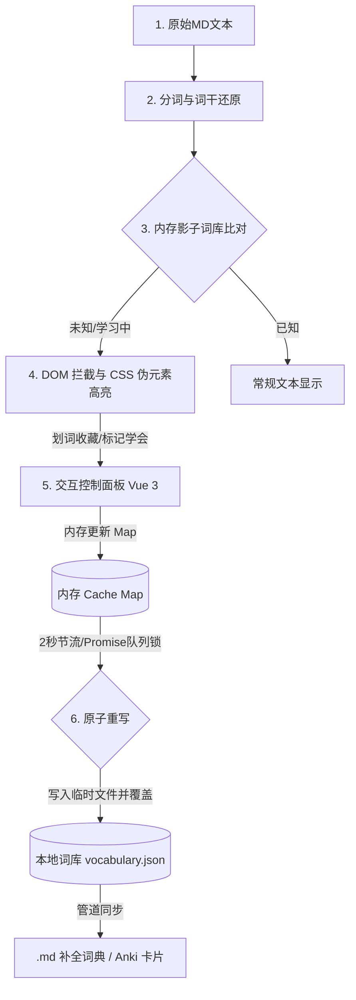

# Obsidian 语言学习助手 (Obsidian Language Learner) 实现计划

本方案旨在为 Obsidian 开发一款深度集成的外语阅读与语言学习插件。它能够在阅读 Markdown 文本时自动进行分词与词干还原，对比内存词库并在 DOM 中高亮陌生词汇。用户可通过悬浮窗或 Vue 3 交互面板管理单词状态，并自动生成语境卡片笔记。

## 用户审核要求

> [!IMPORTANT]
> 1. **数据存储位置**：用户本地词库 `vocabulary.json` 将保存在 Vault 的根目录下。
> 2. **词汇卡片生成位置**：默认将卡片存放在 `LangLearner/Cards/` 目录下（用户可在插件设置中自定义）。
> 3. **网络依赖性**：为了实现冷启动词汇估算和词形还原字典校验，构建时会运行脚本将 20,000 高频词和不规则变形词表预先内联打包进 `main.js`。插件在运行时**完全离线**，无需发起任何网络请求。

## 开发 Open Questions

1. **二分估算问答的细节**：目前的方案是每次二分点附近抽取 5 个词，用户认识 3 个及以上（≥ 60%）则认为该频段已掌握。用户对此比例或二分机制是否有特殊要求？
2. **生词卡片模板**：默认模板使用 Front Matter。用户是否需要支持自定义模板格式？

---

## 核心系统架构与数据流

插件的运行时生命周期和数据流如下图所示：

---

## 拟提出的修改/创建文件

我们将按照以下组件层级从零开始构建插件：

### 1. 项目基础与打包配置

#### [NEW] [package.json](file:///Users/up_dong/Documents/open_workspace/obsidian-english-learner/package.json)
配置 NPM 依赖，包含 `vue`、`obsidian` 声明文件、`esbuild` 及其 Vue 插件、TypeScript 编译链。

#### [NEW] [tsconfig.json](file:///Users/up_dong/Documents/open_workspace/obsidian-english-learner/tsconfig.json)
TypeScript 配置，开启对 `.vue` 和 DOM 类型的支持。

#### [NEW] [manifest.json](file:///Users/up_dong/Documents/open_workspace/obsidian-english-learner/manifest.json)
Obsidian 插件元数据，配置插件 ID、名称、版本、入口点等。

#### [NEW] [esbuild.config.mjs](file:///Users/up_dong/Documents/open_workspace/obsidian-english-learner/esbuild.config.mjs)
使用 `esbuild-plugin-vue3` 配置 esbuild，支持将 TypeScript 与 Vue 3 单文件组件打包成单个 `main.js`。

#### [NEW] [scripts/generate_data.js](file:///Users/up_dong/Documents/open_workspace/obsidian-english-learner/scripts/generate_data.js)
构建前执行的数据准备脚本：
- 下载 Google 20,000 高频词频表。
- 下载并逆转 irregular-plurals 和 english-verbs-irregular。
- 整合生成 `src/data/wordFrequency.ts` 和 `src/data/lemmas.ts`。

---

### 2. 文本分词与词干还原 (Tokenization & Lemmatization)

#### [NEW] [src/tokenizer/tokenizer.ts](file:///Users/up_dong/Documents/open_workspace/obsidian-english-learner/src/tokenizer/tokenizer.ts)
- 清理 Markdown 标记：剥离 `[[wikilinks]]`、代码块、图片等。
- 精准分词：利用正则提取英文 Token，记录其在原文中的起始与结束 `offset`。
- **词组最大前向匹配 (Maximum Forward Matching)**：
  - 基于还原后的词干序列 (Lemmatized Sequence) 进行词组探测，最大匹配长度 $N=4$。
  - 遍历 Token 序列时，依次向后截取最大长度词干组合，在影子词库 Map 或常见短语字典中进行匹配。
  - 若命中词组，则将对应的多个 Token 合并为一个“词组 Token”输出，并在 DOM 渲染时作为一个整体包裹；未命中则退化为单字处理。
- 噪音过滤器：排除数字、特定标点、URL、常见人名/地名。

#### [NEW] [src/tokenizer/lemmatizer.ts](file:///Users/up_dong/Documents/open_workspace/obsidian-english-learner/src/tokenizer/lemmatizer.ts)
- 词形还原核心：
  1. 优先查表：在不规则变化词典 `lemmas.ts` 中以 $O(1)$ 速度匹配原型。
  2. 规则推导 + 字典验证：针对名词复数、动词时态、形容词比较级应用形态规则（例如去掉 `-ing`/`-ed`/`-es` 或添加 `-e`/`-y`），在 20,000 高频词表中做有效性校验，得出最合理的原型（Lemma）。
  3. **英美音与拼写重定向 (Spelling Align)**：
     - 内置常见英美音互换映射（例如 `colour -> color`, `analyse -> analyze`）。分词还原后，先做重定向对齐，映射到词库中的统一键名。
     - **安全拼写模糊容错**：严禁在阅读自动高亮高频率段做静默纠错替换（如 form->from）。Levenshtein 编辑距离为 1 的模糊匹配算法仅限在侧边栏手动查词联想推荐，或针对词长大于 5 字符的偏僻词做提示，不修改原文高亮。

---

### 3. 内存影子词库与并发控制 (Vocabulary DB)

#### [NEW] [src/types.ts](file:///Users/up_dong/Documents/open_workspace/obsidian-english-learner/src/types.ts)
定义 `WordStatus`（UNKNOWN, LEARNING, KNOWN）和 `WordInfo` 类型定义。

#### [NEW] [src/db/vocabulary.ts](file:///Users/up_dong/Documents/open_workspace/obsidian-english-learner/src/db/vocabulary.ts)
- **内存影子副本**：插件启动时读取并加载 `vocabulary.json` 进 `Map<string, WordInfo>`。
- **写回节流**：使用 lodash 风格的 2000ms 节流器，多处修改只在 2 秒后触发一次落盘。
- **Promise 队列锁**：使用 `isSaving` 状态锁防止写回冲突。
- **Capacitor 移动端安全原子写入**：
  1. 通过 `this.app.vault.adapter.write("vocabulary.json.tmp", content)` 写入临时文件。
  2. 验证写入正常后，调用 `this.app.vault.adapter.rename("vocabulary.json.tmp", "vocabulary.json")` 覆盖。

---

### 4. DOM 拦截高亮与 CSS 气泡 (Markdown Post-Processor)

#### [NEW] [src/styles.css](file:///Users/up_dong/Documents/open_workspace/obsidian-english-learner/src/styles.css)
- 高亮样式：`.lang-learner-word.un-known`（虚下划线）和 `.lang-learner-word.learning`（高亮）。
- 零 JS 消耗悬浮窗：利用 `:hover::after` 伪元素，将 `data-trans` 和 `data-phonetic` 转换为悬浮气泡，保证流畅滑动。

#### [NEW] [src/main.ts](file:///Users/up_dong/Documents/open_workspace/obsidian-english-learner/src/main.ts)
- 插件主类：
  - 注册 `registerMarkdownPostProcessor`，在 HTML 渲染时切分 DOM 文本节点，对生词用 `` 进行包裹。
  - **阅读仪表盘与降噪滤镜 (Dashboard & Slider)**：
    - 在 Post-Processor 完成全文扫描后，计算该文的熟词率和词频占比，在文档最顶部动态注入一个由 Vue 或纯 HTML 渲染的极简 Dashboard。
    - 在 Dashboard 中提供降噪滑块（Difficulty Slider），通过给文章 Container 绑定特定的类名（例如 `.lang-learner-noise-level-3`），利用全局 CSS 规则选择性给词频在 8000 以上的生词/偏僻词添加半透明（`opacity: 0.15`）灰色样式，实现文本渐进式降噪。
  - 全局增量刷新：提供 `refreshWordsInDOM(word, status)` 方法。当单词状态在 UI 改变时，直接通过 `document.querySelectorAll` 查找并修改 Class，避免全页重绘，实现微秒级褪色。

---

### 5. 交互控制面板与估算模块 (Vue 3 Panel)

#### [NEW] [src/event/EventBus.ts](file:///Users/up_dong/Documents/open_workspace/obsidian-english-learner/src/event/EventBus.ts)
发布订阅 Event Bus，解耦标签页 A 和右侧 Vue 3 面板，实现多窗口实时同步。

#### [NEW] [src/ui/SidebarView.ts](file:///Users/up_dong/Documents/open_workspace/obsidian-english-learner/src/ui/SidebarView.ts)
Obsidian `ItemView` 包装类，用于初始化、挂载和卸载 Vue 3 的 `Panel.vue`。

#### [NEW] [src/ui/Panel.vue](file:///Users/up_dong/Documents/open_workspace/obsidian-english-learner/src/ui/Panel.vue)
- 单词详情展示：展示当前选中生词的详细释义和来源，并支持一键修改熟悉度状态。
- **冷启动二分估算**：
  - 时间复杂度 $O(\log N)$ 二分法：搜索范围 `[0, 20000]`，每次以 1000 个词为一个频段阶梯。
  - 每次展示中点频段 of 5 个代表单词供用户勾选。
  - 估算完成后批量将水位线以下的词标记为 `KNOWN` 并异步写入文件。
- **一键泛化熟词 (Learn Article)**：
  - **白名单过滤器防止污染**：点击“一键学完”时，系统将文章全量 Token 集合与内置 20,000 高频词表取交集，再与用户标记的生词/学习词取差集。超纲的冷僻噪声词默认保持不变，不写入本地词库。
  - 批量将该高频过滤后的未标记词状态在内存 Map 中改为 `KNOWN`，并触发 2000ms 节流锁合并安全落盘。
- **本地化词典与翻译降级 (Dictionary Sources)**：
  - 整合内置前 20,000 高频词音标与中文释义的轻量级字典包 (<1MB)。
  - 支持在设置中配置用户自定义本地字典文件。
  - 查词时优先查影子词库及本地字典，断网时降级提示“离线未查到”，联网时异步向第三方翻译 API 请求数据并静默缓存。

---

### 6. 语境收藏本自动生成模块 (Context Note Generator)

#### [NEW] [src/generator/contextNote.ts]
- **追加式多语境追溯 (Append-only Context)**：
  - 自动读取包含生词的整句（通过向前、向后搜索标点符号）。
  - 创建或更新单词卡片：检测 `LangLearner/Cards/{{lemma}}.md` 是否已存在。
  - 若不存在，按指定 Front Matter 模板初始化。
  - 若已存在，**严禁覆盖整个文件**，只解析卡片，在其 `## 历史流转语境 (Context History)` 段落尾部，**追加**当前新文章的时间戳、双链以及句子语境：
    `* [{{date}}] 在 [[{{article_title}}]] 中: > {{context}}`
  - 从而利用 Obsidian 反链机制（Backlinks）织网，实现跨文章多维度记忆关联。
- 派生词关联：在生词卡片中自动插入派生词与原型的双链，如 `[[compile]]`。

---

## 验证计划

### 1. 自动化与单元测试
- 编写测试脚本验证 Tokenizer 在处理包含 Markdown 链接、粗体、斜体、图片等情况下的分词偏移量是否准确。
- 验证 Lemmatizer 的规则和 Exception 表是否能将 `went -> go`, `flies -> fly`, `compiled -> compile`, `running -> run` 精准还原。

### 2. 手动与集成验证
1. **沙盒库初始化**：按照 PRD 规范，在 `/Users/up_dong/Documents/Obsidian-Dev-Sandbox` 初始化测试沙盒并建立软链接。
2. **构建与热重载**：启动 `npm run dev` (esbuild --watch)，在沙盒库中安装 `hot-reload` 插件。
3. **冷启动估算测试**：在 Vue 控制面板中触发冷启动测试，走完二分流程，检查 `vocabulary.json` 中是否批量写入了大量 `KNOWN` 单词。
4. **阅读高亮与悬浮窗**：打开包含测试英语段落的 Markdown 笔记，验证生词是否有虚线下划线高亮，悬浮是否能无 JS 延迟显示音标和翻译。
5. **划词与卡片生成**：标记某个生词为 `LEARNING`，查看是否能在 Vault 下的 `LangLearner/Cards/` 生成带有原形链接和整句语境的 Markdown 文件。
